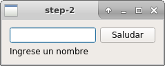
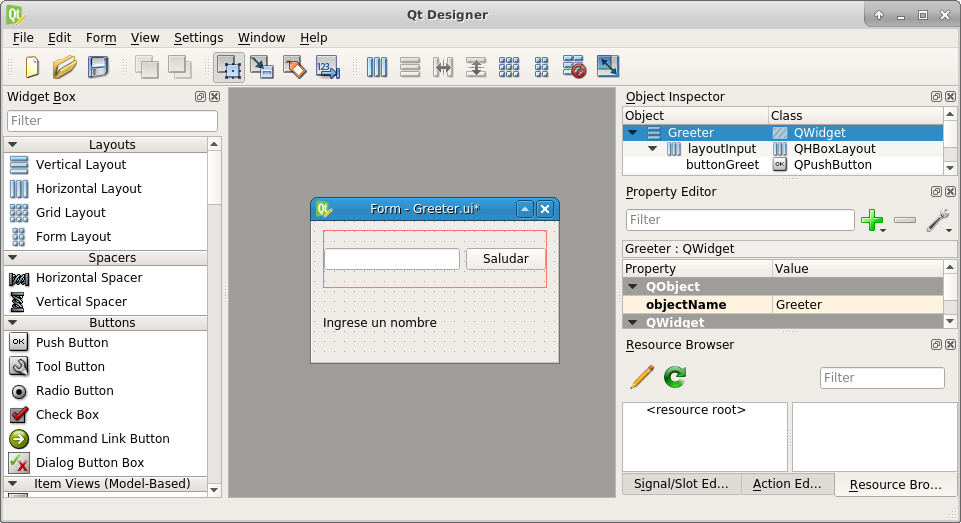
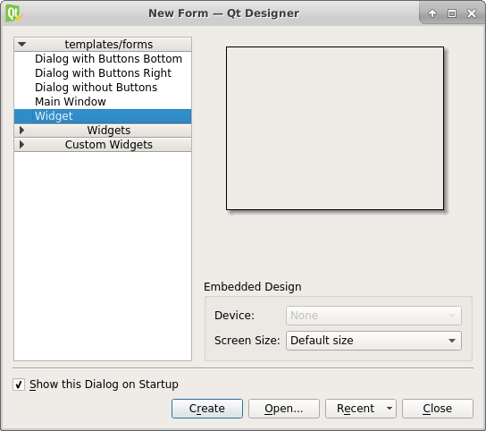
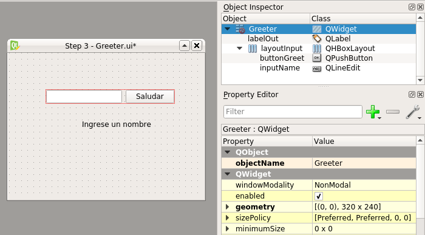
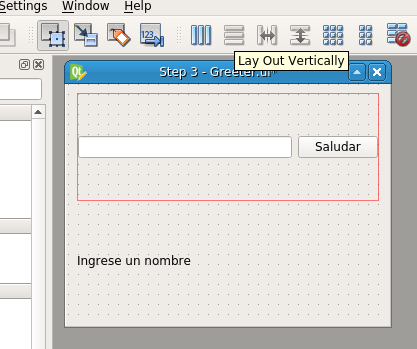

# Ejemplos

A continuación una explicación paso a paso de los ejemplos presentados.

## Ejemplo 0: Hola mundo

La primer aplicación es un ejemplo de "Hola mundo", donde lo único que se hace es mostrar un cuadro de texto con las palabras "Hello QT".

A continuación se detalla el código utilizado

~~~{.cpp .numberLines}
#include <QApplication>
#include <QLabel>

int main(int argc, char *argv[]) {
    // Clase que contiene el loop principal
    QApplication app(argc, argv);
    // Instancio un componente grafico para salida de texto
    // Llamo a QLabel(const QString &text, QWidget *parent=0, Qt::WindowFlags f=0);
    QLabel label("Hello QT");
    // Muestro el elemento
    label.show();
    // Arranca el loop de la UI
    return app.exec();
}
~~~
Para mayor simplicidad, arrancamos con el segundo elemento definido

*QLabel* es un elemento gráfico para mostrar texto plano. Como todo elemento gráfico (de ahora en adelante *widget*), hereda de *QWidget*.
En el constructor utilizado se puede ver que, además de recibir el texto a mostrar por parámentro, también se puede asignar un widget *padre*. Como no se asignó ningun padre, nuestro texto será un widget independiente por lo que tendrá su propia ventana flotante.

Los widgets se crean ocultos por defecto, por lo que el paso siguiente es mostrarlo llamando al método *show*.

*QApplication* es la clase que se encarga de gestionar todos los eventos ocurridos en la aplicación. Este monitoreo de eventos lo realiza en un bucle conocido como *loop de eventos*.
Esta clase una especialización de *QGuiApplication*, que agrega soporte a objetos *QWidget*, y QGuiApplication a su vez hereda de *QCoreApplication*, que es una clase que administra eventos de la aplicación no relacionados con la interfaz gráfica.
*QApplication* inicializa múltiples componentes por lo que debe ser instanciado lo antes posible.

Por último, una vez inicializados los componentes de la aplicación, arranco el loop de eventos con app.exec().

### Compilación

Si bien Qt provee su propio generador de makefiles, llamado *qmake*, para compilar estos ejemplos se utilizará *cmake*.

A continuación las lineas relevantes para configurar el proyecto.

~~~{.cmake .numberLines startFrom=8}
find_package(Qt5Widgets)

add_executable(step-0
  main.cpp)

# Linkea libQt5Widgets.so al ejecutable
target_link_libraries(step-0 Qt5::Widgets)
~~~

*find_package* es una macro que configura variables de compilación de forma similar a como lo hace *pkgconfig*. Existen dos formas de configurar paquetes, una mediante archivos *Find<paquete>.cmake*, y otra mediante archivos *<paquete>Config.cmake*, ambos tipos de archivos instalados en el sistema al momento de instalar las bibliotecas.

En el caso de Qt5, cmake busca un archivo llamado *Qt5WidgetsConfig.cmake* que le indica dónde estan los headers y bibliotecas a linkear.

*add_executable* es la macro que toma una lista de archivos fuentes y los compila en un ejecutable (en este caso generará un binario llamado *step-0*)

*target_link_libraries* toma una lista de bibliotecas a linkear (estática o dinámicamente) para un *target*. El target puede ser un ejecutable o una biblioteca.

Para compilar, suponiendo que está instalado cmake, se debe correr lo siguiente:

~~~{.bashrc}
cmake <ruta-src>
make
~~~

Donde *ruta-src* es la ruta al directorio que contiene el *CMakeLists.txt*.
Si se está posicionado en el mismo directorio, escribir

~~~{.bashrc}
cmake .
~~~

Es buena práctica crear una carpeta *build* y compilar desde ahí para evitar "ensuciar" el directorio de trabajo.

## Ejemplo 1: Layouts básicos

En este ejemplo veremos un widget compuesto de varios elementos.

~~~{.cpp .numberLines startFrom=9}
	// Instancio un widget abstracto padre
    QWidget parent;
    // Creo un layout para que disponga a los widgets en forma vertical
    QVBoxLayout layout(&parent);
    // Creo los widgets
    QLabel label1("Label 1");
    QLabel label2("Label 2");
    QPushButton button("Button");
    // Agrego los widgets al layout vertical
    layout.addWidget(&label1);
    layout.addWidget(&button);
    layout.addWidget(&label2);
    // Muestro el elemento y sus hijos
    parent.show();
~~~

En esta sección de código reemplazamos el anterior *Hola mundo* por una serie de elementos distribuidos verticalmente. Para esto los vamos a agrupar utilizando un widget padre, llamado *parent* que servirá de contenedor.
Este widget abstracto no sabe como distribuir sus elementos *hijos*, por lo que le asignamos un *layout* que servirá como regla de distribución.
Existen varios tipos de *layouts*, como por ejemplo *QBoxLayout* que distribuye los elementos de forma horizontal o vertical, *QGridLayout*, que los distribuye en forma de tabla, o *QStackedLayout*, que los apila de forma que se vea un sólo widget por vez.

En esta demo se utilizará *QVBoxLayout* para disponer los widgets de forma vertical

Como se puede ver, sólo se hace una llamada a *show*, ya que al mostrar el padre, la llamada se propaga a sus hijos.

Si se cambia el tamaño de la ventana, se puede ver que los widgets hijos se acomodan acorde al layout propuesto, es decir, se distribuyen verticalmente y se reparten los espacios vacíos. La alineación vertical y horizontal, entre otros parámetros, son configurables. 
Es importante hacer un buen uso de layouts para adaptarse correctamente a las distintas interfaces del usuario.

### Compilación

El archivo de compilación *CMakeLists.txt* se mantiene casi igual salvo por el nombre del ejecutable a generar.

## Ejemplo 2: widget custom con eventos

En este ejemplo crearemos un widget *custom* que además tendrá una lógica asociada a un evento de la GUI.

Comenzamos creando nuestro widget llamado *Greeter*. Esta clase *Greeter*, que hereda de QWidget, posee una entrada de texto, un botón para accionar el saludo, y una salida de texto donde se muestra el saludo generado.

El constructor no tiene atributos salvo un puntero a un widget padre en caso de querer anidar este widget dentro de otro.

**Greeter.h**

~~~{.cpp .numberLines startFrom=8}
class Greeter : public QWidget {
public:
    explicit Greeter(QWidget *parent = 0);
private:
    // Creo los widgets asignandole un padre
    QLabel labelOut;
    QPushButton buttonGreet;
    QLineEdit inputName;
    void updateGreetings();
};
~~~

El constructor se inicia de esta forma

~~~{.cpp .numberLines startFrom=3}
Greeter::Greeter(QWidget *parent) : QWidget(parent), buttonGreet("Saludar")
~~~

Los componentes se inicializan de forma similar al ejemplo 2 (notese las llamadas a setLayout)

**Greeter.cpp**

~~~{.cpp .numberLines startFrom=4}
    QVBoxLayout* greeterLayout = new QVBoxLayout();
    QHBoxLayout* inputLayout = new QHBoxLayout();
    // Armo la primer linea de widgets con un layout horizontal
    inputLayout->addWidget(&this->inputName);
    inputLayout->addWidget(&this->buttonGreet);
    // Inserto el input y el boton de saludar en la primer linea
    greeterLayout->addLayout(inputLayout);
    greeterLayout->addWidget(&this->labelOut);
    this->labelOut.setText("Ingrese un nombre");
    this->setLayout(greeterLayout);
~~~

Finalmente, conectamos el evento *clicked* del botón a la función privada *updateGreetings* de nuestro widget. De esta forma, cada vez que hagamos click sobre el botón, se actualizará el texto de salida. El primer parametro es el boton que lanza el evento, el segundo es el evento que se esta conectando, el tercer parametro es el widget que recibe el evento, y el cuarto es la funcion que responde al evento.

~~~{.cpp .numberLines startFrom=21}
QObject::connect(&this->buttonGreet, &QPushButton::clicked,
                 this, &Greeter::updateGreetings);
~~~

En la implementación de *updateGreetings* el texto de salida *labelOut* se actualizará tomando el texto de entrada del componente *inputName*.

~~~{.cpp .numberLines startFrom=26}
    QString name = this->inputName.text();
    QString greetings = QString("Hola %1").arg(name);
    this->labelOut.setText(greetings);
~~~

Una vez que ya tenemos nuestro widget implementado, podemos incluirlo y utilizarlo en nuestro *main*

**main.cpp**

~~~{.cpp .numberLines startFrom=8}
    Greeter greeter;
    greeter.show();
~~~

### Compilación

Agregamos el nuevo archivo fuente a nuestro *CMakeLists.txt* y compilamos regularmente

~~~{.cmake .numberLines startFrom=6}
add_executable(step-2
  Greeter.cpp
  main.cpp)
~~~

## Ejemplo 3: Interfaces con Qt-Designer

### Diseño de la UI

En este ejemplo diseñaremos el widget *Greeter* con la herramienta *designer* del paquete de desarrollo de Qt. Designer es una herramienta que permite diseñar las UIs (*User Interfaces*) de forma gráfica, siendo más intuitivo y práctico.

El primer paso va a ser diseñar la UI con Designer. Al iniciar la aplicación nos abre una ventana donde nos permite seleccionar qué tipo de componente crear (o abrir uno ya existente). Como reimplementaremos el *Greeter*, seguiremos utilizando QWidget como base, aunque se pueden utilizar otros templates si es más conveniente.

Haciendo drag and drop de los elementos de la barra a la izquierda, replicamos el mismo arbol de componentes que hicimos programáticamente en *Greeter*.
Para ver este árbol, abrir la herramienta *Object Inspector* en el menú *View*.

Abrir el *Property editor* y observar qué propiedades son configurables para cada widget que se va agregando.
Cambiar la propiedad *QObject* -> *Object name* para que refleje los nombres utilizados en el ejemplo anterior.
También cambiar los textos del *label* y del botón.

Una vez arreglados los componentes, aplico el layout vertical al widget, seleccionandoló (haciendo click en un espacio en blanco o sobre él en el Object inspector), y haciendo click en el botón *Lay out vertically* de la barra de herramientas.

Para ver una vista previa del widget, ir al menú *Form* -> *Preview...*

Finalmente guardamos el proyecto en formato *.ui*. Este formato es un archivo xml que luego es utilizado para generar el código C++ de la interfaz.

### Implementación

Nuestra clase Greeter a simple vista se simplifica. El header deja de estar compuesto por widgets, ya que ahora los declara el archivo *.ui*. Se agrega un método privado *connectEvents* por conveniencia.

**Greeter.h**

~~~{.cpp .numberLines startFrom=6}
class Greeter : public QWidget {
public:
    explicit Greeter(QWidget *parent = 0);
private:
    void updateGreetings();
    void connectEvents();
};
~~~

En el *.cpp* con la implementación de los métodos, se agrega un nuevo header autogenerado *ui_Greeter.h*.

Este header es generado a partir de *Greeter.ui*, utilizando una herramienta llamada *uic*. El código de mismo se puede ver ejecutando

~~~{.bashrc}
uic Greeter.ui
~~~

Si observamos el código vemos que se declara una clase llamada *Ui_Greeter* y luego se abre un namespace *Ui* que crea otra clase llamada *Greeter*.
Para este ejemplo es indistinto qué clase usar, por lo que usaremos la segunda que es la más usada en los ejemplos.

Instanciamos un *Ui::Greeter* y ejecutamos la función *setupUi*, que se encarga de crear los widgets y asignarles el padre.

Notar que también llama a los métodos *retranslateUi* y *connectSlotsByName*, que son para aplicar traducciones de texto y para autoconectar señales, respectivamente.

**Greeter.cpp**

~~~{.cpp .numberLines startFrom=3}
#include "ui_Greeter.h"

Greeter::Greeter(QWidget *parent) : QWidget(parent) {
    // Instancio la configuracion generada por el designer y uic
    Ui::Greeter greeter;
    // Configuro este widget para use esa configuracion
    greeter.setupUi(this);
    connectEvents();
}
~~~

Nosotros llamamos a *connectEvents* para conectar los eventos a mano, de forma similar al ejemplo 2.

Ahora vamos a ver como cambia la implementación de *updateGreetings*, ya que los componentes no pertenecen más al widget padre, sino que hay que buscarlos por su nombre

~~~{.cpp .numberLines startFrom=13}
void Greeter::updateGreetings() {
    QLineEdit* inputName = findChild<QLineEdit*>("inputName");
    QLabel* labelOut = findChild<QLabel*>("labelOut");
    QString name = inputName->text();
    QString greetings = QString("Hola %1").arg(name);
    labelOut->setText(greetings);
}
~~~

Como se puede ver, el método que hace la mágia es findChild. Este método, perteneciente a QObject, busca un widget hijo según su nombre (recordar que seteamos los mismos mediante el editor de propiedades del designer).
Se puede modificar el nombre de un objeto programáticamente mediante el método *setObjectName*

De la misma forma conectamos los eventos, usando findChild para encontrar los elementos a conectar.

~~~{.cpp .numberLines startFrom=27}
void Greeter::connectEvents() {
    // Conecto el evento del boton
    QPushButton* buttonGreet = findChild<QPushButton*>("buttonGreet");
    QObject::connect(buttonGreet, &QPushButton::clicked,
                     this, &Greeter::updateGreetings);
}
~~~

### Compilación

Se agrego una estructura de carpetas para mayor prolijidad de código. Si bien el archivo está bastante autodocumentado, la función más relevante para este ejemplo es

~~~{.cmake .numberLines startFrom=17}
qt5_wrap_ui(UIS_HEADERS
        ui/Greeter.ui
)
}
~~~

Esta macro toma los archivos *.ui* pasados como parámetro, ejecuta *uic* sobre ellos, y almacena los nombres de los headers generados en la variable puesta como primer parámetro. Los headers generados tendrán nombres con formato ui_{filename sin .ui}.h

# TODO

* Investigar sobre autoconectar señales.
* Explicar *promoted widgets* en el designer.
* Modelo de Signals & slots
* Ejemplos de QPainter
