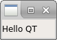
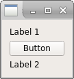

# GUIs

---

## Comparación de frameworks

Biblioteca | GTK | wxWidgets | Qt
---|---|---|---
Tipo de biblioteca | Framework gráfico | Framework gráfico | Framework de uso general
Plataforma | Unix | Multiplataforma | Multiplataforma
Ultimo major release | _ | _ | 
Lenguaje base | C | C++ | C++
Herramientas de compilación | PkgConfig | wxConfig | qmake
Componentes nativas | Si | Si | No
Editor gráfico | Glade | wxGlade | QtDesigner

???

Entre los frameworks de desarrollo de interfaces de usuario los más famosos son **GTK**, **wxWidgets** y **Qt**

Los dos primeros son exclusivamente gráficos, mientras que Qt es un framework de propósito general. Esto significa que *Qt* no se limita a proveer funciones para dibujar en pantalla, sino que también provee clases para interactuar con la placa de sonido, para trabajar con sockets, threads, hasta incluso para bases de datos.

*Gtk* es exclusivamente para unix, mientras que *wxWidgets* y *Qt* son multiplataforma.

*Gtk* está escrito en C, aunque posee un *wrapper* en C++. *wxWidgets* y *Qt* fueron hechos en C++

Para administrar las dependencias, *Gtk* utiliza *PkgConfig*, una herramienta bastante popular a la hora de proveer una interfaz para manejar las dependencias a la hora de compilar.
WxWidgets utiliza una herramienta propia de ellos, wxConfig, al igual que Qt, que utiliza qmake.

*GTK* utiliza bibliotecas nativas del sistema para dibujar sus componentes. *WxWidgets* provee una interfaz para utilizar bibliotecas nativas del sistema operativo para el cuál se está compilando (en el caso de unix, utiliza *GTK*). 
*Qt* realiza el dibujado de los widgets en su misma biblioteca, lo cuál conlleva menor rendimiento pero mayor uniformidad.

---

## Esquema del hola mundo

~~~{.cpp}
int main(int argc, char *argv[]) {
    QApplication app(argc, argv);
    QLabel label("Hello QT");
    label.show();
    return app.exec();
}
~~~

???

La primer aplicación es un ejemplo de "Hola mundo", donde lo único que se hace es mostrar un cuadro de texto con las palabras "Hello QT".

Para mayor simplicidad, arrancamos con el segundo elemento definido

*QLabel* es un elemento gráfico para mostrar texto plano. Como todo elemento gráfico (de ahora en adelante *widget*), hereda de *QWidget*.
En el constructor utilizado se puede ver que, además de recibir el texto a mostrar por parámentro, también se puede asignar un widget *padre*. Como no se asignó ningun padre, nuestro texto será un widget independiente por lo que tendrá su propia ventana flotante.

Los widgets se crean ocultos por defecto, por lo que el paso siguiente es mostrarlo llamando al método *show*.

*QApplication* es la clase que se encarga de gestionar todos los eventos ocurridos en la aplicación. Este monitoreo de eventos lo realiza en un bucle conocido como *loop de eventos*.
Esta clase una especialización de *QGuiApplication*, que agrega soporte a objetos *QWidget*, y QGuiApplication a su vez hereda de *QCoreApplication*, que es una clase que administra eventos de la aplicación no relacionados con la interfaz gráfica.
*QApplication* inicializa múltiples componentes por lo que debe ser instanciado lo antes posible.

Por último, una vez inicializados los componentes de la aplicación, arranco el loop de eventos con app.exec().

---

## Layouts

~~~{.cpp}
	// Instancio un widget abstracto padre
    QWidget parent;
    // Creo un layout para que disponga a los widgets en forma vertical
    QVBoxLayout layout(&parent);
    // Creo los widgets
    QLabel label1("Label 1");
    QLabel label2("Label 2");
    QPushButton button("Button");
    // Agrego los widgets al layout vertical
    layout.addWidget(&label1);
    layout.addWidget(&button);
    layout.addWidget(&label2);
~~~

